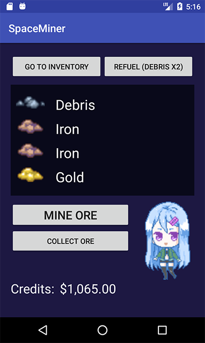
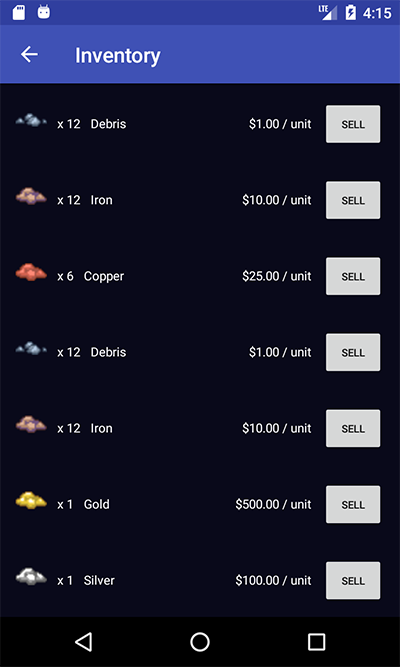

# SpaceMiner
A simple game of mining ore and making money.

## about
This is an item collection game that uses asynchronous tasks to mine ore, collect ore, sell ore,
and refuel a finite resource. I wrote this to get more familiar with UI, recycleviews, datasources,
and asynctasks. This game can be scaled to add crafting and other activities.

The ore mining task involves comparing the modulus of a random integer and another integer, the result
of which determines how likely the ore is to occur. For example, Gold ore is less likely to appear
than Iron ore.

To play, simply click "MINE" to mine 10x. To refuel, click "REFUEL". Click "INVENTORY" to view
the inventory activity and sell mined ores. Credits will display in the main activity.

## screenshots

